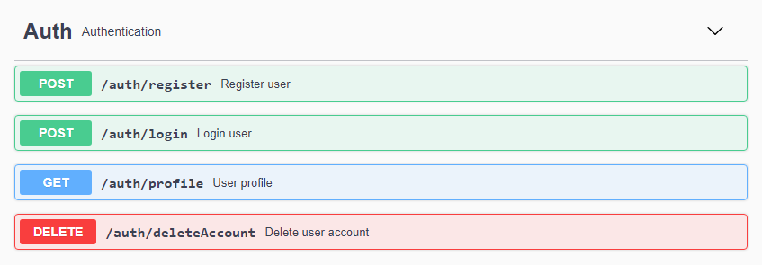
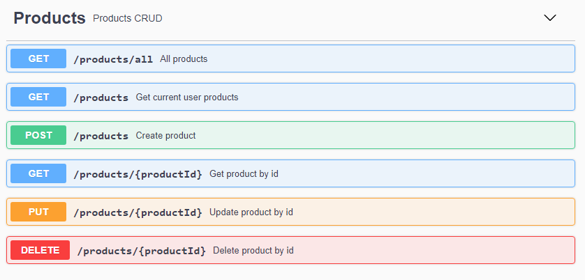

# API REST - TypeScript TypeORM MySQL

NodeJs TypeScript API REST using TypeORM with MySQL for User Authentication with jwt,passport,roles and validations.

## Getting Started 🚀

These instructions will get you a copy of the project up and running on your local machine for development and testing purposes.

### Installation 🔧

- Clone the repo
  ```sh
  git clone https://github.com/jonathanmejia-ar/typescript-typeorm-mysql.git
  ```
- Install NPM packages
  ```sh
  npm install
  ```

### Run app 💻

- Start local server
  ```sh
  npm run dev
  ```

## Swagger API Documentation

Running on `http://localhost:3000/api-docs`

## Routes and enpoints

### Auth



### Products



### Models


## Dependencies 🛠️

- [express](https://www.npmjs.com/package/express) - NodeJs Framework used for handling and routing HTTP requests.
- [typeorm](https://www.npmjs.com/package/typeorm) - TypeORM is an ORM library that allows us to interact with databases through functions without sql commands.
- [mysql](https://www.npmjs.com/package/mysql) - Relational database management system developed by Oracle.
- [passport](https://www.npmjs.com/package/passport) - Express-compatible authentication middleware for Node.js.
- [passport-jwt](https://www.npmjs.com/package/passport-jwt) - Passport strategy for authenticating with a JSON Web Token.
- [joi](https://www.npmjs.com/package/joi) - Powerful schema description language and data validator for JavaScript.
- [bcryptjs](https://www.npmjs.com/package/bcryptjs) - Library to help you hash passwords.
- [jsonwebtoken](https://www.npmjs.com/package/jsonwebtoken) - Open JSON-based standard proposed by IETF for token creations.
- [yup](https://www.npmjs.com/package/yup) - Yup is a JavaScript schema builder for value parsing and validation.
- [helmet](https://www.npmjs.com/package/helmet) - Helps you secure your Express apps by setting various HTTP headers.
- [http-errors](https://www.npmjs.com/package/@curveball/http-errors) - This package contains a list of standard HTTP exceptions for Typescript.
- [swagger-jsdoc](https://www.npmjs.com/package/swagger-jsdoc) - reads your JSDoc-annotated source code and generates an OpenAPI (Swagger) specification
- [swagger-ui-express](https://www.npmjs.com/package/swagger-ui-express) - Allows you to serve auto-generated swagger-ui generated API docs from express, based on a swagger.json file.

## Contact

If you want to contact me you can reach me at <jonathanmejia.ar@gmail.com>.
